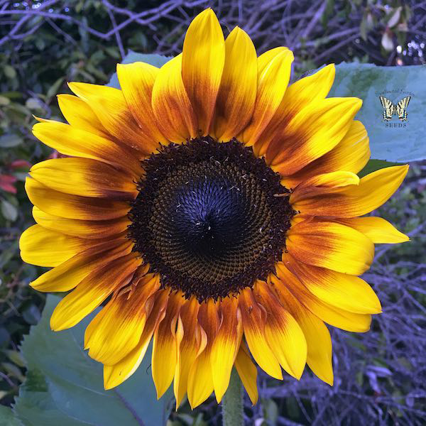

# pixel-sort

This is a very simple idea I discovered when watching obscure YouTube videos about programming late a night one day. Somebody had discovered when you take a picture and sort it based on its color you get some very intereting result. This is because of the way colors are stored in within a single integer. Each color channel is stored within the same integer and each change takes up 8 bits, you'll notice each of the 3 color channels plus 1 for the alpha add up to 32 bits, or exactly one integer. Colors are stored in this format AAAAAAAARRRRRRRRGGGGGGGGBBBBBBBB where each of these letter represnts a single bit, R for red, G for Green, etc. This means a small change in the red channel will drastically increase the vaule of the entire integer and if you sort the colors based on their integer value you get some really neat looking results.

